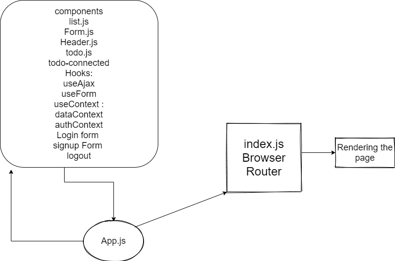

# To Do List
creating auth not from the starter code 

make a login form with authorization functions 

make a signup form 

make a capabelities for the user who logged 

make a logout function

 we’d like to extend the functionality of the application by requiring users be logged in to view items and also restrict access based on user type. The user stories from Phases 1, 2 and 3 remain unchanged. For this phase, we are now adding the following new user stories.

# [netlify](https://ak94-finished.netlify.app/)

UML

