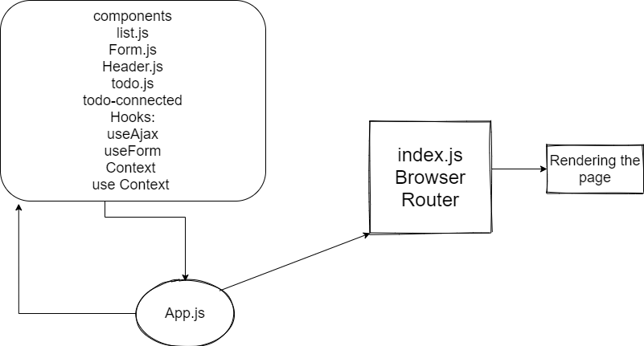

# To Do List
make limit post in every page and make next and prev page

make setting for number of item per page ,

make setting for show/hidden complete item 

convert using props to useContext in the list 

remove all function in todo-connected and make everything 
in hooks and use Context

In Phase 3, we’d like to extend the functionality of the application by potentially allowing users to set a few configuration options to change how the application behaves. The user stories from Phases 1 and 2 remain unchanged. For this phase, we are now adding the following new user stories.

# [netlify](https://ak-todoconnected.netlify.app/)

UML

